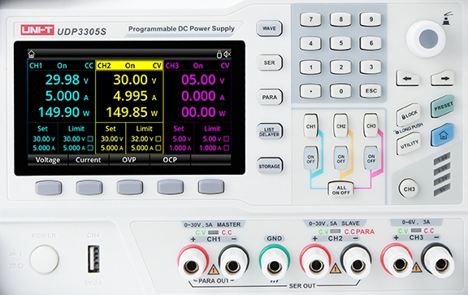

# UPD3305S

Python class for controlling Uni-T UDP3305S or UDP3305S-E lab power supply units.




# In a nutshell

    #!/bin/env python3
    import time, datetime
    from UDP3305S import UDP3305S

    psu = UDP3305S("TCPIP::192.168.0.66::INSTR")

    # setup voltage and current limits
    psu.ch1.voltage = 13.5
    psu.ch1.current = 3
    psu.ch2.voltage = 24
    psu.ch2.current = 4.5

    # query the set voltage
    v1 = psu.ch1.voltage
    v2 = psu.ch2.voltage

    # activate the first two channels
    psu.ch1.on()
    psu.ch2.on()

    # log current and power for about 30 seconds
    print("timestamp, A1, P1, A2, P2")
    for i in range(30):
        print(", ".join([str(x) for x in [
                datetime.datetime.now().strftime("%Y-%m-%d %H:%M:%S"),
                psu.ch1.read_current(),
                psu.ch1.read_power(),
                psu.ch2.read_current(),
                psu.ch2.read_power(),
        ]]))
        time.sleep(1)

    # turn off all channels
    psu.off()


# Status

[](https://github.com/nikku/works-on-my-machine)
UDP3305S, LINUX.

| Feature                              | Status |
|------------------------------------  |------- |
| Output on/off                        | ✓      |
| All 3 channels                       | ✓      |
| Serial, parallel mode                | ✓      |
| Set/get voltage, current             | ✓      |
| OCP, OVP                             | ✓      |
| Voltage, current and power readout   | ✓      |
| List mode                            | —      |
| Delayer mode                         | —      |
| Trigger setup                        | —      |


# Installation

1. Download the latest release package (` udp3305s-XXX.tar.gz `) from github.
2. If you want to install in a virtual environment, first, create and activate it:
```
python -m venv .venv
source .venv/bin/activate
```
3. Install the package (replace *XXX* with the correct number)
```
python -m pip install udp3305s-XXX.tar.gz
```


# Reference

The following sections give a tour of available functionality.

The device is represented by an `instrument` object which has several `channel`
objects. *Parameters* of the instrument or channels are implemented as
*properties* – i.e. instance variables that can be read and assigned to (e.g.
set voltage). Functionalities are implemented as methods and can be called
as usual (e.g. measured voltage) and may return a value.

## Connecting

This is how you connect to the load:

    from UDP3305S import UDP3305S

    # Ethernet connected
    psu = UDP3305S("TCPIP::192.168.0.66::INSTR")

    # USB connected
    psu = UDP3305S("ASRL/dev/ttyUSB1::INSTR")
    
    # USB connected on windows (com2):
    psu = UDP3305S("ASRL2::INSTR")

Of course, you need to adapt it to the right device for your case. See
[here](https://pyvisa.readthedocs.io/en/latest/introduction/names.html) for
details on pyvisa resource names.

## Instrument

The instrument instance provides the following methods.

    # Getting device identification
    print(psu.idn)

    # turn all outputs on/off
    psu.on()
    psu.off()

    # lock/unlock the keypad
    psu.lock()
    psu.unlock()

    # Reset the device
    psu.reset()

    # Set device to normal mode
    psu.mode = "normal"
    # set to serial mode
    psu.mode = "SER"
    # set to parallel mode
    psu.mode = "PARA"

    # Send your own SCPI commands
    # without return value
    psu.write("RST")
    # with return value
    print(psu.query("*IDN?"))


## Channels

The PSU has 3 physical channels `ch1`, `ch2` and `ch3`.  All channels are
available as attributes of the instrument object. 
    
    # Set voltage and current limit for ch2
    psu.ch2.voltage = 13.4
    psu.ch2.current = 2.7

    # Add ovp and ocp limits
    psu.ch2.ovp = 15.0
    psu.ch2.ocp = 3.0

    # turn on the channel
    psu.ch2.on()

    # read voltage, current and power
    V = psu.ch2.read_voltage()
    I = psu.ch2.read_current()
    P = psu.ch2.read_power()

    # read all three values at once
    (V, I, P) = psu.ch2.read_all()

    # turn off the channel
    psu.ch2.off()

The first two channels can be combined in either serial or parallel mode
yielding the virtual channels `chSER` and `chPAR`, respectively. 

    # Switch to serial mode
    psu.mode = "SER"

    # Set voltage and current limit
    psu.chSER.voltage = 45.0
    psu.chSER.current = 3.8


## Module documentation

Detailed api-documentation is given in the doc-strings of the classes.
Use pydoc to access it:

    python -m pydoc UDP3305S
    python -m pydoc UDP3305S.instrument
    python -m pydoc UDP3305S.channel

For questions about valid values for all commands and general use of the
device, please refer to the manufacturers user manual and/or scpi manual.  


# Contributing

If you think you found a bug or you have an idea for a new feature, please open
an issue here on GitHub. Please **do not submit pull-requests before discussing
the issue** you want to address.

If you want to report a bug, please make sure to replicate the erroneous
behavior at least once before opening an issue and provide all information
necessary to replicate the problem (what commands did you use, what was
connected to the load, what did you observe, what did you expect?).
